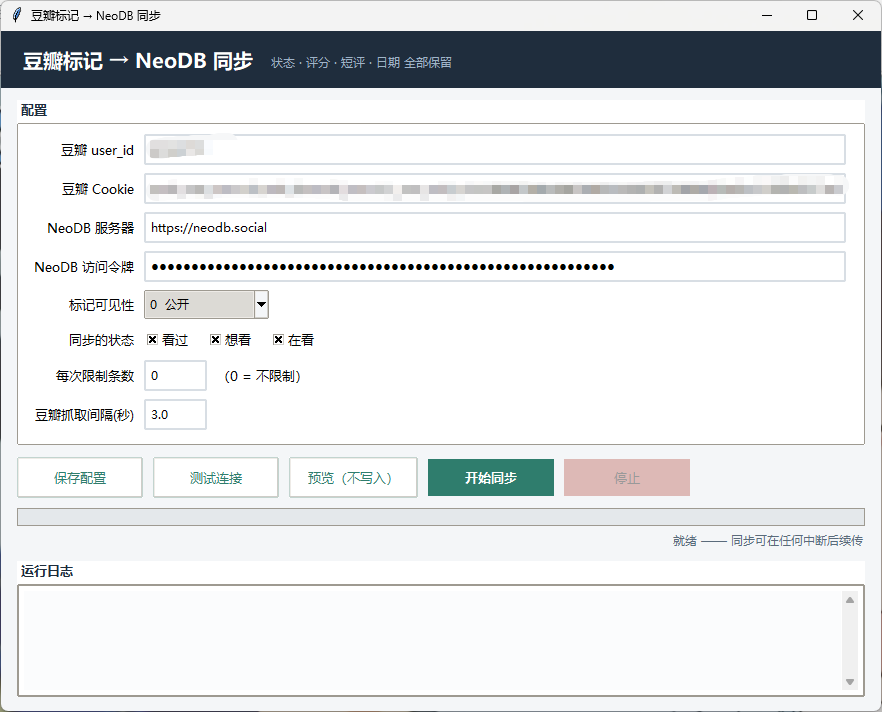

# 离豆 douban2neodb

**离豆**——离开豆瓣，标记不散。把豆瓣上已标记的电影（看过 / 想看 / 在看，含星级、短评、标记日期）
直接同步到 NeoDB，**不经过任何导出文件**。

原理与「豆坟」等豆瓣备份工具一致：用你自己的豆瓣登录 Cookie 抓取标记列表页，
再逐条调用 NeoDB 官方 API 写入。支持增量同步——未变化的条目自动跳过，可以反复运行、随时中断续传。

> 纯本地运行的 Python 脚本，提供图形界面和命令行两种用法，只有一个 `requests` 依赖。

## 为什么做这个工具

豆瓣上的影视条目时不时会「消失」——下架、合并、审核，都可能让多年攒下的标记和短评说没就没。
而豆坟这类备份工具流程偏繁琐：装插件、等备份、导出文件、再手动导入。

于是有了这个工具：**一条命令（或一次点击），标记连同评分、短评、日期直接搬进开源的 NeoDB**，
数据从此握在自己手里，不依赖任何中间文件。

## 功能

- 同步状态：看过 → complete，想看 → wishlist，在看 → progress
- 同步内容：状态、星级（豆瓣 5 星制自动换算为 NeoDB 10 分制）、短评、标记日期（保留原日期）
- 增量幂等：本地缓存 + 与 NeoDB 已有标记双重比对，重复运行不产生重复标记
- 断点续传：任何时刻中断（关机、停止按钮、报错）后重跑即可继续
- 可选可见性：公开 / 仅关注者 / 仅自己
- 豆瓣抓取带随机间隔与风控检测，默认节奏保守（每页约 3~4 秒）

## 环境要求

- Python 3.9+
- `pip install requests`

## 准备三个凭据

| 配置项 | 获取方式 |
| --- | --- |
| 豆瓣 user_id | 你的豆瓣主页地址 `https://www.douban.com/people/xxxxxx/` 里的 `xxxxxx` |
| 豆瓣 Cookie | 浏览器登录 douban.com 后，F12 → Network → 任一请求 → Request Headers 里整串 `Cookie:`（单行复制） |
| NeoDB 访问令牌 | 见下一节「获取 NeoDB 令牌」，或 NeoDB 网页 → 头像 → 设置 → **开发者（Developer）** → 创建令牌，勾选 `read` + `write` |

把 `config.example.ini` 复制为 `config.ini` 并填入以上内容（自建 NeoDB 实例请同时修改 `base_url`）。

## 获取 NeoDB 令牌（网页小工具）

仓库自带一个单文件小工具 [`docs/token-tool.html`](docs/token-tool.html)，双击本地打开（或访问在线版），三步拿到令牌：

1. **创建应用** —— 填好实例地址（默认 `neodb.social`，自建实例可改），点「创建应用」
2. **授权** —— 点「打开授权页面」会新开 NeoDB 的授权页，登录并确认后，把页面上显示的授权码粘回工具
3. **获取 Token** —— 点一下拿到 `access_token`，带一键复制，填进 `config.ini` 即可

> 令牌全程在你的浏览器本地生成，不经过任何第三方服务器。在线版：<https://melon5531.github.io/douban2neodb/token-tool.html>

## 使用

**图形界面**：双击 `启动同步界面.bat`（或 `python gui.py`）。
填好配置后依次点「测试连接 → 预览（不写入）→ 开始同步」；同步中有进度条与实时日志，可随时停止。



**命令行**：

```bash
python sync_douban_to_neodb.py check                 # 验证豆瓣 Cookie 和 NeoDB 令牌
python sync_douban_to_neodb.py sync --dry-run        # 只抓取预览，不写入
python sync_douban_to_neodb.py sync --limit 20       # 先同步 20 条试效果
python sync_douban_to_neodb.py sync                  # 全量增量同步（看过+想看+在看）
python sync_douban_to_neodb.py sync --statuses collect,wish   # 只同步指定状态
python sync_douban_to_neodb.py sync --full           # 忽略本地缓存，全部与 NeoDB 重比
```

## 工作原理

```
豆瓣标记列表页 (movie.douban.com/people/<uid>/collect|wish|do)
        │  用你的 Cookie 分页抓取，解析标题/星级/短评/日期
        ▼
GET /api/catalog/fetch?url=<豆瓣条目链接>   ← NeoDB 收录条目（已在库则直接返回 uuid）
        ▼
POST /api/me/shelf/item/<uuid>              ← 写入标记（状态/评分/短评/created_time）
```

抓取结果会缓存在 `marks_cache.json`（6 小时内有效），重跑时无需重新抓豆瓣；删除该文件即可强制重抓。
每条成功同步的记录会写入 `state.json`（内容签名），配合 NeoDB 端比对实现增量。

## 常见问题

- **豆瓣提示异常请求 / 要求登录**：触发风控。等几小时、必要时重新复制 Cookie，
  并调大 `config.ini` 里的 `delay`（不要低于 2 秒）。
- **个别条目收录失败**：多为豆瓣已下架条目，NeoDB 无法收录，脚本会跳过并在结尾汇总。
- **NeoDB 返回 401**：令牌已失效（重新生成过令牌或退出登录会使旧令牌作废），重新生成即可。
- **会不会重复同步？** 不会。本地缓存 + NeoDB 端标记比对，重复运行只处理有变化的部分。
- **隐私**：`config.ini`、`state.json`、`marks_cache.json` 均在 `.gitignore` 中，
  包含你的 Cookie、令牌和个人标记数据，请勿分享。

## 免责声明

本项目仅供个人备份**自己的**豆瓣数据使用，请勿用于抓取他人数据或任何商业用途。
对豆瓣的访问方式属于个人数据导出，与豆瓣服务条款的关系请自行评估；使用本项目产生的
账号风控等后果由使用者自行承担。本项目与豆瓣和 NeoDB 官方均无关联。

## 致谢

- [NeoDB](https://github.com/neodb-social/neodb) —— 开源、联邦宇宙的书影音记录服务
- [bambooom/douban-backup-extension](https://github.com/bambooom/douban-backup-extension)、[zx2592/douban_backup](https://github.com/zx2592/douban_backup) —— 同类豆瓣备份项目（抓取思路来源）

## License

[MIT](LICENSE)
